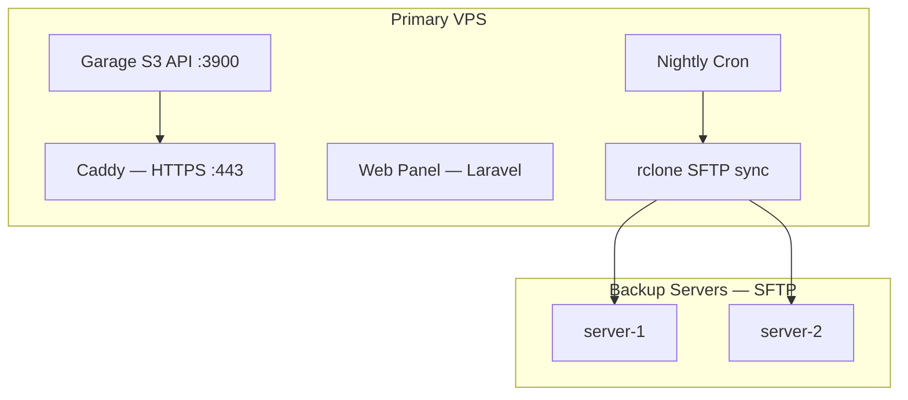

# Johnny

**Self-hosted S3-compatible object storage, automated backups, and an elegant web panel — in one install.**

Johnny wraps [Garage](https://garagehq.deuxfleurs.fr/) with production-ready automation: TLS via Caddy, nightly SFTP backups with retention, a `johnny` CLI, and an optional Laravel web panel with two-factor authentication.

> **Current release:** see [`VERSION`](VERSION) &middot; **License:** [MIT](LICENSE)

---

## Key Features

| | |
|---|---|
| **S3-compatible storage** | Powered by Garage — use any AWS SDK, `aws` CLI, or S3 client |
| **One-command install** | Single script sets up Garage, Caddy (Let's Encrypt TLS), rclone, cron |
| **Automated SFTP backups** | Nightly sync of every bucket to one or more remote servers, with configurable retention |
| **Web panel** | Laravel-based dashboard for buckets, objects, and API keys (optional) |
| **Provisioning API** | Authenticated HTTP endpoint to create a bucket, a dedicated Garage key, and return S3 connection details (optional panel) |
| **Two-factor auth** | TOTP 2FA + password reset via SMTP on the web panel |
| **Self-updating** | Nightly cron pulls the latest release, runs migrations, and refreshes the panel |

---

## Architecture



- **Orchestration runs only on the primary VPS** (push model). Backup servers only need SSH/SFTP and disk space.
- Default S3 credentials for applications are stored in `/etc/johnny/credentials/default-s3.env`.
- An internal backup key (`johnny-backup`) lives in `/etc/johnny/credentials/backup-internal-s3.env` and is scoped to local `http://127.0.0.1:3900`.

---

## Requirements

- **Ubuntu 24.04 LTS** on the primary VPS
- **DNS** `A`/`AAAA` record pointing your chosen hostname to the server **before** installation (Let's Encrypt needs to validate the domain)
- For each backup target: **SSH/SFTP** reachable from the primary, with a user that can write under the remote path

---

## Quick Start (Autoinstall)

Clone **outside `/root`** (e.g. `/opt/johnny`) so the Laravel panel can run as `www-data`:

```bash
sudo mkdir -p /opt && sudo git clone https://github.com/andreapollastri/johnny /opt/johnny
cd /opt/johnny
sudo bash scripts/autoinstall.sh
```

The interactive wizard will:

1. Install dependencies (Python 3, Caddy, rclone, …) and run `scripts/install.sh`
2. Start Garage and bootstrap a single-node layout
3. Create bucket `default`, API keys `johnny-default` (apps) and `johnny-backup` (nightly sync), and write env files under `/etc/johnny/credentials/`
4. Configure **Caddy** with automatic TLS for your S3 domain
5. Create `/etc/johnny/backup.json` (retention: 90 days, empty targets)
6. Install `/etc/cron.d/johnny-nightly` (self-update at 02:30, backup at 03:00)
7. Optionally install the **web panel** (PHP 8.5-FPM, Composer, Laravel migrate, Caddy vhost)

Once complete, load your app credentials:

```bash
source /etc/johnny/credentials/default-s3.env
aws s3 ls --endpoint-url "$AWS_ENDPOINT_URL"
```

---

## Manual Install (Without Autoinstall)

```bash
sudo bash scripts/install.sh
sudo systemctl start johnny-garage
sudo bash scripts/bootstrap-single-node.sh
```

Then configure TLS yourself — see `config/caddy-johnny.caddy.example` or `config/nginx-johnny-s3.conf.example`. Create credentials and keys with `sudo -u johnny johnny key create …` as needed.

---

## Web Panel

The optional Laravel panel provides a browser-based interface to manage **buckets**, **objects**, and **Garage API keys**.

### Install the Panel

If you chose to skip the panel during autoinstall, you can add it later:

```bash
sudo bash scripts/install-panel.sh /opt/johnny https://panel.example.com
```

The script installs PHP 8.5-FPM, Composer, runs Laravel migrations and caches, and wires the Garage credentials from `/etc/johnny/credentials/default-s3.env` into `panel/.env`.

See `config/caddy-panel.caddy.example` for the Caddy vhost configuration.

### Create an Admin User

```bash
sudo -u www-data php /opt/johnny/panel/artisan johnny:admin you@example.com 'strong-password'
```

Open `https://<panel-hostname>` and sign in. Go to **Security** to enable **two-factor authentication** (TOTP).

### API Keys via the Panel

The Keys page calls `sudo -u johnny johnny key list` under the hood. The sudoers rule is installed automatically during autoinstall; for manual installs, copy the example:

```bash
sudo install -m 0440 config/johnny-panel.sudoers.example /etc/sudoers.d/johnny-panel
```

### Provisioning API

When the panel is installed, it exposes a **JSON API** to provision a new Garage bucket together with a fresh S3 key scoped to that bucket. This is useful for automation (onboarding tenants, CI, internal tools) without logging into the UI for each bucket.

**Authentication:** [Laravel Sanctum](https://laravel.com/docs/sanctum) personal access tokens. Create a token in the panel under **Security → Panel API tokens**, or issue one from the server:

```bash
sudo -u www-data php /opt/johnny/panel/artisan johnny:api-token you@example.com --name=provisioning
```

Send the token on every request:

```http
Authorization: Bearer <your-token>
Accept: application/json
```

**Endpoint:** `POST /api/buckets/provision`  
Use your panel base URL, for example `https://panel.example.com/api/buckets/provision`.

**Request body (JSON, optional):**

| Field | Type | Description |
|---|---|---|
| `bucket` | string, optional | Bucket name. Must match `^[a-z0-9][a-z0-9._-]{1,254}$`. If omitted, a unique name is generated (prefix `b-` plus random hex). |

Example body: `{}` or `{"bucket":"my-tenant-data"}`.

**Success (HTTP 201):** the response is a JSON object including:

| Field | Description |
|---|---|
| `bucket` | Created bucket name |
| `region` | From `GARAGE_DEFAULT_REGION` in `panel/.env` (default `johnny`) |
| `endpoint` | Public S3 URL from `GARAGE_ENDPOINT` (same as app-facing HTTPS endpoint) |
| `path_style` | `true` — use path-style addressing for S3 clients |
| `key_name` | Garage key name (`bucket-` plus random hex) |
| `credentials` | `access_key_id` and `secret_access_key` for S3 |
| `env` | Convenience map: `AWS_ACCESS_KEY_ID`, `AWS_SECRET_ACCESS_KEY`, `AWS_DEFAULT_REGION`, `AWS_ENDPOINT_URL` |

The server creates the bucket, creates the key, grants that key read/write/owner on the bucket, and grants the panel’s Garage key (`GARAGE_KEY_NAME`, default `johnny-default`) full access so the UI can manage the bucket.

**Errors:** validation failures return **422** with `message` and `detail`. Other failures may return **422** (bucket creation) or **500** (key creation or permission steps) with a JSON body describing the problem.

**Example:**

```bash
curl -sS -X POST "https://panel.example.com/api/buckets/provision" \
  -H "Authorization: Bearer YOUR_SANCTUM_TOKEN" \
  -H "Accept: application/json" \
  -H "Content-Type: application/json" \
  -d '{"bucket":"customer-orders"}'
```

**Requirements:** the panel database must include Sanctum’s `personal_access_tokens` table (run `php artisan migrate` after upgrades). PHP must be allowed to run `sudo -u johnny /usr/local/bin/johnny` as for the rest of the panel (see **API Keys via the Panel** above).

---

## Configuring SMTP for Password Reset

By default the panel uses `MAIL_MAILER=log`, which means outbound emails (including password-reset links) are **not sent** — they are only written to the Laravel log.

To enable real email delivery, edit `panel/.env` and set the SMTP variables:

```dotenv
MAIL_MAILER=smtp
MAIL_HOST=smtp.example.com
MAIL_PORT=587
MAIL_USERNAME=your-smtp-user@example.com
MAIL_PASSWORD=your-smtp-password
MAIL_SCHEME=tls
MAIL_FROM_ADDRESS=noreply@yourdomain.com
MAIL_FROM_NAME="Johnny Panel"
```

Then rebuild the config cache:

```bash
sudo -u www-data php /opt/johnny/panel/artisan config:cache
```

**Common SMTP providers:**

| Provider | Host | Port | Scheme |
|---|---|---|---|
| **Mailgun** | `smtp.mailgun.org` | 587 | tls |
| **Amazon SES** | `email-smtp.<region>.amazonaws.com` | 587 | tls |
| **Brevo (Sendinblue)** | `smtp-relay.brevo.com` | 587 | tls |
| **Postmark** | `smtp.postmarkapp.com` | 587 | tls |
| **Gmail** | `smtp.gmail.com` | 587 | tls |
| **Generic SMTP** | your provider's host | 465 (ssl) / 587 (tls) | ssl / tls |

Once configured, users can click **"Forgot your password?"** on the login page and receive a reset link via email.

---

## Updating

The repo path is saved during install in `/etc/johnny/repo.path`, so updates work without arguments:

```bash
sudo johnny update --pull
```

This does:

1. `git pull --ff-only` (when `--pull` is passed)
2. Sync scripts to `/usr/local/share/johnny`
3. `composer install` + `artisan migrate` + cache rebuild (if the panel is present)
4. Execute any pending numbered migration scripts from `scripts/migrations/`

A **nightly cron** (`/etc/cron.d/johnny-nightly`) runs `johnny update --pull` at **02:30** and the SFTP backup at **03:00**. Logs: `/var/log/johnny-update.log`.

Check the installed version:

```bash
cat /usr/local/share/johnny/VERSION
```

---

## `johnny` CLI Reference

### General

```bash
sudo johnny version          # Print installed version
sudo johnny status           # Garage cluster status
sudo johnny update [--pull]  # Update (see above)
```

### Buckets & Keys (Garage passthrough)

```bash
sudo johnny bucket list
sudo -u johnny johnny bucket create my-bucket
sudo johnny key list
sudo -u johnny johnny key create my-key
```

### Backup Targets (SFTP)

| Command | Description |
|---|---|
| `sudo johnny backup list` | List targets, retention, remote base path |
| `sudo johnny backup create NAME` | Add a target (interactive or with `--host`, `--port`, `--user`, `--password`) |
| `sudo johnny backup delete NAME` | Remove a target |
| `sudo johnny backup update NAME` | Update fields; use `-p` to prompt for a new password |
| `sudo johnny backup set-retention N` | Keep dated folders for N days (default 90) |
| `sudo johnny backup run` | Run the backup job immediately |

Configuration: `/etc/johnny/backup.json` (mode `600`). Passwords are stored in plain text — protect this file.

### Remote Layout After Backups

```text
johnny-backups/
  2026-04-03/
    default/
    my-bucket/
  2026-04-04/
    default/
    my-bucket/
```

Date folders older than `retention_days` are automatically removed.

---

## Nightly Backup Details

- Implemented in `scripts/johnny-nightly-backup.py` (installed to `/usr/local/share/johnny/scripts/`)
- Uses **rclone** to sync `johnny_local:<bucket>` to `sftp:<remote>:<base>/<date>/<bucket>/`
- Ensures key `johnny-backup` has read permission on every bucket before syncing
- Retention is date-based: folders named `YYYY-MM-DD` older than `retention_days` are deleted

Logs: `/var/log/johnny-nightly.log`

---

## S3-to-S3 Replication (Optional)

For Garage-to-Garage replication over S3 (in addition to SFTP backups), use the included scripts:

```bash
# Configure a replication env (see config/replication/media-to-eu.env.example)
cp config/replication/media-to-eu.env.example config/replication/media-to-eu.env
# Edit with your remote Garage credentials, then run:
sudo bash scripts/replicate-run.sh config/replication/media-to-eu.env
```

---

## Security Notes

- Restrict `/etc/johnny` (especially `backup.json` and `credentials/`) — default permissions are already `600`/`700`
- Prefer **SSH keys** on backup servers for production use; Johnny documents password auth for simplicity
- Firewall: expose **443** (and **80** for ACME) only; restrict **22** to trusted IPs where possible
- `rclone sync` can delete extra files on the destination under each dated prefix — see the [rclone sync docs](https://rclone.org/commands/rclone_sync/)

---

## Configuration Reference

| File | Purpose |
|---|---|
| `/etc/johnny/garage.toml` | Garage configuration |
| `/etc/johnny/backup.json` | Backup targets and retention |
| `/etc/johnny/credentials/default-s3.env` | App S3 credentials |
| `/etc/johnny/credentials/backup-internal-s3.env` | Internal backup S3 credentials |
| `/etc/johnny/repo.path` | Path to the Johnny repo (for updates) |
| `/etc/johnny/migrations.state` | Last applied migration number |
| `/etc/cron.d/johnny-nightly` | Cron schedule |
| `panel/.env` | Laravel panel environment |

Example configs are in the `config/` directory of this repository.

---

## License

MIT — see [LICENSE](LICENSE).
