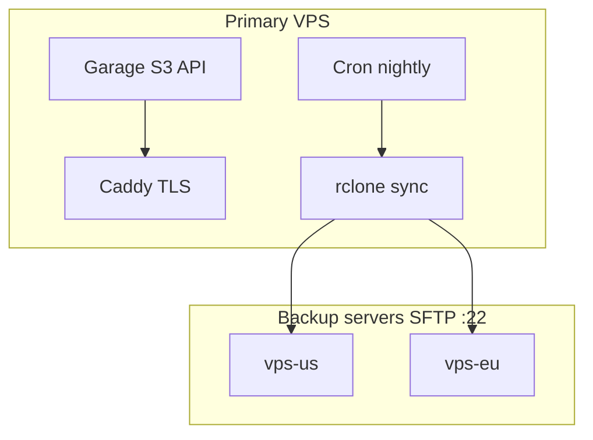

# Johnny

**Version 1.0.0** — see the [`VERSION`](VERSION) file. Future releases bump SemVer there. **Install** is driven by **`scripts/install.sh`**, **`scripts/autoinstall.sh`**, and **`scripts/install-panel.sh`**; **`scripts/update.sh`** repeats the same sync + panel refresh after a `git pull`. Optional numbered scripts under **`scripts/migrations/`** are reserved for the future (folder kept with **`.gitkeep`** only for now).

**Johnny** packages [Garage](https://garagehq.deuxfleurs.fr/) for **Ubuntu 24.04 LTS** with:

- One-shot **autoinstall** (Garage layout, default S3 keys, **Caddy + Let’s Encrypt**, nightly cron).
- A **`johnny` CLI** that wraps Garage and adds **`johnny backup`** to manage **SFTP backup targets** (IP, port, user, password).
- Optional **Laravel 13** web panel under **`panel/`** (**Fortify** login, **2FA**, minimal CSS + vanilla Blade) for buckets, objects, and Garage API keys (via `sudo -u johnny johnny …`).
- A **nightly job** (primary VPS only) that, for **each** configured target, syncs **every Garage bucket** into a dated tree:

  `remote_base_path/YYYY-MM-DD/<bucket-name>/…`

  then **deletes** dated folders older than **`retention_days`** (default **90**).

The storage engine is still upstream **Garage** (`garage` binary). Johnny adds paths under `/etc/johnny` and `/var/lib/johnny`, region **`johnny`**, and automation around backups and TLS.

## How it fits together



- **Orchestration runs only on the primary VPS** (push). Backup servers only need SSH/SFTP and disk; they do **not** need Garage unless you also use them for something else.
- **Default S3 credentials** for applications are written to `/etc/johnny/credentials/default-s3.env` during autoinstall.
- **Internal** credentials for the nightly job (`johnny-backup` key) live in `/etc/johnny/credentials/backup-internal-s3.env` (local `http://127.0.0.1:3900` only).

## Requirements

- Ubuntu **24.04** on the primary VPS.
- **DNS** pointing your chosen hostname to this server **before** autoinstall (Let’s Encrypt must validate the domain).
- For each backup host: **SSH/SFTP** reachable from the primary (port configurable, default **22**), with a user that can write under your chosen remote path (default base folder: `johnny-backups` on the SFTP home or as resolved by the server).

## One-shot autoinstall (recommended)

On a fresh VPS, clone **outside `/root`** (e.g. `/opt/johnny`) so the Laravel panel install can run Composer and PHP as `www-data`. A checkout only under `/root/...` is not readable by `www-data` because `/root` is private to root.

```bash
sudo mkdir -p /opt && sudo git clone https://github.com/andreapollastri/johnny /opt/johnny
cd /opt/johnny
sudo bash scripts/autoinstall.sh
```

You will be prompted to confirm, then for the **public domain** used for the S3 HTTPS endpoint (e.g. `storage.example.com`). Optionally, you can install the **Laravel panel** on another hostname (default `panel.<your-s3-domain>`). The script:

1. Installs dependencies (**python3**, **caddy**, **rclone**, …) and runs `scripts/install.sh`.
2. Starts Garage, runs **single-node layout** (`bootstrap-single-node.sh`).
3. Creates bucket **`default`**, API keys **`johnny-default`** (for apps) and **`johnny-backup`** (for nightly sync), and writes env files under `/etc/johnny/credentials/`.
4. Writes **`/etc/caddy/johnny.caddy`** and imports it from `/etc/caddy/Caddyfile` (existing file is backed up).
5. Creates **`/etc/johnny/backup.json`** with **`retention_days`: 90** and empty **`targets`**.
6. Installs **`/etc/cron.d/johnny-nightly`** (default **03:00** server time).
7. Optionally runs **`scripts/install-panel.sh`**, configures **PHP 8.5-FPM** (via `ppa:ondrej/php` on Ubuntu), imports **`/etc/caddy/johnny-panel.caddy`**, and wires **`GARAGE_*`** from `/etc/johnny/credentials/default-s3.env` into **`panel/.env`**.

After install, use your app credentials from:

`source /etc/johnny/credentials/default-s3.env`

Then e.g. `aws s3 ls` with `AWS_ENDPOINT_URL` set to `https://your-domain`.

### Web panel (Laravel)

If you enabled the panel during autoinstall, create the first admin:

```bash
sudo -u www-data php /path/to/johnny/panel/artisan johnny:admin you@example.com 'strong-password'
```

Open `https://<panel-hostname>`, sign in, then use **Security** to enable **two-factor authentication** (Fortify TOTP). The panel talks to Garage using **`GARAGE_*`** in **`panel/.env`** (same access key/secret as `default-s3` unless you change it).

**API keys (Garage CLI):** the Keys page runs `sudo -u johnny johnny key list`. Install **`config/johnny-panel.sudoers.example`** as `/etc/sudoers.d/johnny-panel` (the autoinstall does this when the panel is installed) so `www-data` may invoke `/usr/local/bin/johnny` as user `johnny`.

**Manual panel install** (if you did not use autoinstall):

```bash
sudo bash scripts/install-panel.sh /path/to/johnny/repo https://panel.example.com
```

The install script registers the clone as a **Git safe directory** (for Git ≥ 2.35), runs **Composer as root** so `panel/vendor` can be created on a root-owned tree, then **`chown`s `panel/` to `www-data`**, and sets **`COMPOSER_ALLOW_SUPERUSER=1`** for non-interactive Composer. It uses a **`run_wwwdata` helper** so redirects and temp files are never created by root while targeting `panel/` (a root-owned `>` after `sudo -u www-data` breaks `.env` updates). If you install dependencies by hand: add `git config --global --add safe.directory /path/to/johnny`, run Composer from a user that can write `panel/`, or use the same root-then-chown pattern.

See `config/caddy-panel.caddy.example` for a Caddy vhost on `panel/public`.

## Update

After pulling new commits in your clone (e.g. `/opt/johnny`), run **`scripts/update.sh`** as root. It optionally **`git pull --ff-only`** (`--pull`), then does the same **sync to `/usr/local/share/johnny`** as **`scripts/install.sh`** (via **`scripts/lib/sync-johnny-share.sh`**), and if **`panel/artisan`** exists, runs **Composer + Laravel migrate + caches** (same idea as **`install-panel.sh`**, without reinstalling PHP packages). **No numbered migration scripts** are required for 1.0.0 — the **`scripts/migrations/`** directory only holds **`.gitkeep`** until you add optional future scripts.

Check the installed release: **`cat /usr/local/share/johnny/VERSION`**. Tag Git releases with **`v1.0.0`**, **`v1.1.0`**, … alongside **`VERSION`** bumps.

```bash
sudo bash /opt/johnny/scripts/update.sh /opt/johnny --pull
sudo johnny update /opt/johnny --pull
# or: sudo JOHNNY_REPO=/opt/johnny johnny update --pull
```

## Manual install (without autoinstall)

```bash
sudo bash scripts/install.sh
sudo systemctl start johnny-garage
sudo bash scripts/bootstrap-single-node.sh
```

Configure TLS yourself (see `config/nginx-johnny-s3.conf.example` or `config/caddy-johnny.caddy.example`). Create `/etc/johnny/credentials/*.env` and keys with `sudo -u johnny johnny key create …` as needed.

## `johnny` CLI

Besides **`johnny version`** / **`johnny --version`** (prints **`VERSION`** from `/usr/local/share/johnny/VERSION` when installed) and **`sudo johnny update /path/to/repo [--pull]`** (see [Update](#update)), Garage commands pass through:

```bash
sudo johnny status
sudo johnny bucket list
sudo -u johnny johnny bucket create my-bucket
```

Backup targets (SFTP) — **run as root**:

| Command                              | Description                                                                                            |
| ------------------------------------ | ------------------------------------------------------------------------------------------------------ |
| `sudo johnny backup list`            | List targets and show retention / remote base path                                                     |
| `sudo johnny backup create NAME`     | Interactive prompts for host, port, user, password (or use `--host`, `--port`, `--user`, `--password`) |
| `sudo johnny backup delete NAME`     | Remove a target                                                                                        |
| `sudo johnny backup update NAME`     | Change fields; use `-p` to prompt for a new password                                                   |
| `sudo johnny backup set-retention N` | Keep dated folders not older than **N** days (default **90**)                                          |
| `sudo johnny backup run`             | Run the same job as cron immediately                                                                   |

Configuration file: **`/etc/johnny/backup.json`** (mode `600`). Passwords are stored **in plain text** — protect this file. You can edit **`remote_base_path`** here (default **`johnny-backups`**, created under the SFTP user’s home unless the server chroots elsewhere).

### Remote layout after backups

On each SFTP target you should see folders like:

```text
johnny-backups/
  2026-01-23/
    default/
    my-bucket/
  2026-01-24/
    default/
    my-bucket/
```

Older date folders are removed when **`date < today - retention_days`**.

## Nightly job details

- Implemented in **`scripts/johnny-nightly-backup.py`** (installed under `/usr/local/share/johnny/scripts/`).
- Uses **rclone** to sync `johnny_local:<bucket>` → `sftp:<remote>:<base>/<date>/<bucket>/`.
- Ensures key **`johnny-backup`** has **read** permission on every bucket before syncing (best-effort `bucket allow`).
- **Retention** uses the dates in folder names (`YYYY-MM-DD`) under `remote_base_path`.

Logs: **`/var/log/johnny-nightly.log`**.

## Security notes

- Restrict **`/etc/johnny`** (especially `backup.json` and `credentials/`).
- Prefer **SSH keys** on backup servers in the long term; Johnny currently documents **password** auth for simplicity.
- Firewall: expose **443** (and **80** if needed for ACME), **22** only from trusted IPs where possible.
- `rclone sync` can **delete** extra files on the destination under each dated prefix; read the [rclone sync](https://rclone.org/commands/rclone_sync/) docs.

## Optional: S3-to-S3 replication

Older scripts **`backup-replicate.sh`** and **`replicate-run.sh`** remain for Garage-to-Garage replication over **S3**, if you still want that in addition to SFTP backups.

## License

MIT — see [LICENSE](LICENSE).
